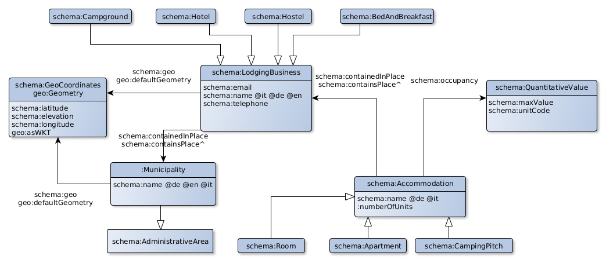
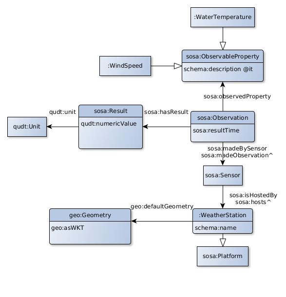

# Destination tutorial for Ontop

This tutorial is derived from [the Virtual Knowledge Graph](https://github.com/noi-techpark/it.bz.opendatahub.sparql) of the South Tyrolean [Open Data Hub](https://opendatahub.bz.it/).

## Requirements
 - Docker
 - Protégé 5.5 with the Ontop 4.1.0 plugin installed. A bundle is available [here](https://sourceforge.net/projects/ontop4obda/files/ontop-4.1.0/).
 - Optionally [DBeaver](https://dbeaver.io/) or another database tool for visualizing the data source.

## Clone this repository

On Windows
```sh
git clone https://github.com/ontopic-vkg/destination-tutorial  --config core.autocrlf=input
```

Otherwise, on MacOS and Linux:
```sh
git clone https://github.com/ontopic-vkg/destination-tutorial
```

## Setup Protégé
* Run Protégé (*run.bat* on Windows, *run.sh* on Mac/Linux)
* Register the PostgreSQL JDBC driver: go to *Preferences -> JDBC Drivers* and add an entry with the following information
   * Description: *postgresql*
   * Class Name: *org.postgresql.Driver*
   * Driver file (jar): */path/to/destination-tutorial/jdbc/postgresql-42.2.8.jar*
* Go to *Reasoner* and select *Ontop 4.1.0* .

## Start Docker-compose

* Go to the `destination-tutorial` repository
* Start the default Docker-compose file

```sh
docker-compose pull && docker-compose up
```

This command starts and initialises the database. Once the database is ready, it launches the SPARQL endpoint of Ontop at http://localhost:8080 .

For this tutorial, we assume that the ports 7777 (used for database) and 8080 (used by Ontop) are free. If you need to use different ports, please edit the file `.env`.


## Dataset

The dataset is composed of the following tables:
 - `source1.municipalities`
 - `source1.hospitality`
 - `source1.rooms`
 - `source2.hotels`
 - `source2.accommodation`
 - `source3.weather_platforms`
 - `source3.weather_measurement`
 - `source3.measurement_types`

### Optional: visualize it in DBeaver
To visualize the dataset in DBeaver or a similar tool, the credentials to access the PostgreSQL database are the followings:
 - Host: *localhost*
 - Port: 7777
 - User: *postgres*
 - Password: *postgres2*


## Mapping

In this tutorial, the ontology and the SPARQL queries are already provided. We will focus on the mapping. Our goal is achieve a fragment of the following diagrams.

For tables in the schemas `source1` and `source2`:



For tables in the schema `source3`:



The initial mapping includes already an entry describing municipalities.

### Open the project on Protégé

On Protégé, open (in a new window if requested) the ontology file `vkg/dest.ttl`. Go to the *Ontop Mappings* tab (if you don't see it, enable it in *Windows -> Tabs*) and to the *Mapping manager* sub-tab. One mapping entry called *Municipality* should be visible.

If you click of *File -> Save*, your changes will be saved and the Ontop SPARQL endpoint will be automatically restarted.

### Proposed sequence
 1. Map the municipality geometries
 2. Map the names, telephone, email and the main class of `source1` lodging businesses
 3. Map these lodging businesses to municipalities
 4. Map their geometries
 5. Map the sub-classes of `source1` lodging businesses
 6. Map the names and descriptions of `source1` accommodations
 7. Map `source1` accommodations to their lodging businesses
 8. Map the names and the main class of `source2` lodging businesses
 9. Map these lodging businesses to municipalities
 10. Map the main class, names and geometries of weather stations
 11. Map weather observations
 12. Map weather sensors
 13. Map weather results
 14. Map the observed properties
 

The concrete steps will be demonstrated during the live session and be added to this page later.


## Solutions

First, stop the current docker-compose.

Then
```sh
docker-compose -f docker-compose.solution.yml up
```

This Docker-compose file uses the mapping `vkg/dest-solution.obda`.

You can see it in Protégé by opening the ontology `vkg/dest-solution.ttl` in a different window.

Example SPARQL queries are available at http://localhost:8080/ .

## To know more

Visit https://ontop-vkg.org . This official website provides a more detailed tutorial.