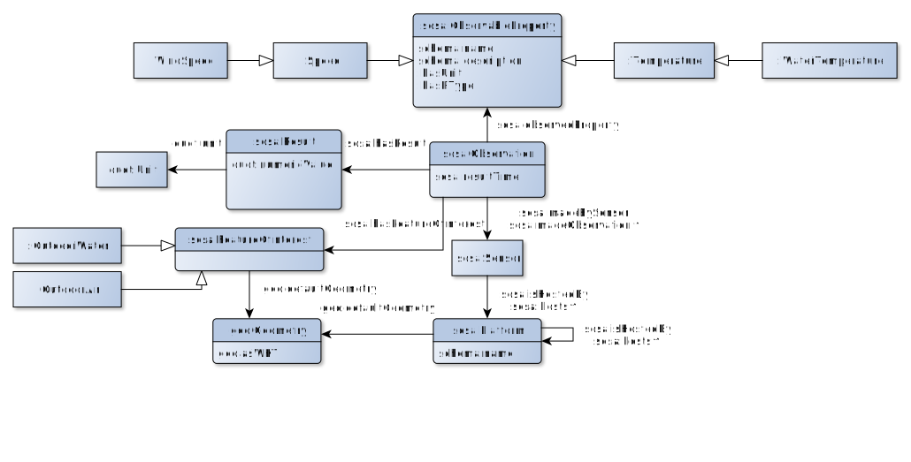

# Mapping entries

## Source 1

Let us start mapping data coming from the first source according to the following diagram: 


***M0 `source1` - Municipality***

This first mapping entry is already provided in the mapping file.

- Target
```sparql
data:municipalities/{istat} a :Municipality ; schema:name {name_it}@it , {name_de}@de , {name_en}@en ; geo:defaultGeometry data:geo/municipalities/{istat} ; schema:geo data:geo/municipalities/{istat} . 
```
- Source
```sql
SELECT * FROM source1.municipalities 
```
Some remarks:

- The target part is described using a [Turtle-like syntax](https://github.com/ontop/ontop/wiki/TurtleSyntax) while the source part is a regular SQL query.
- We used the unique constraint _istat_ to create the IRI. [As demonstrated in the official Ontop tutorial](https://ontop-vkg.org/tutorial/mapping/primary-keys), this practice enables to remove self-joins, which is very important for optimizing the query performance.
- This entry could be split into several mapping entries:
```sparql
data:municipalities/{istat} a :Municipality.
data:municipalities/{istat} schema:name {name_it}@it , {name_de}@de , {name_en}@en.
data:municipalities/{istat} geo:defaultGeometry data:geo/municipalities/{istat}. 
data:municipalities/{istat} schema:geo data:geo/municipalities/{istat} . 
```
Note: To map data properties, we use the data directly from table using the column names. For the object properties `schema:geo` and `geo:defaultGeometry`, we create a new IRI template using the same primary key in order to obtain a geometry object that is specific to the municipality.

Let us now add the other mapping entries by clicking on create:

***M1 `source1` - Municipality-geometry***
- Target
```sparql
data:geo/municipality/{istat} a schema:GeoCoordinates ; schema:longitude {longitude} ; schema:latitude {latitude} ; schema:elevation {altitude} ; geo:asWKT {wkt}^^geo:wktLiteral . 
```
- Source
 ```sql
SELECT *, ST_AsText(geometrypoint) AS wkt FROM source1.municipalities
```
Note: As we use the [GeoSPARQL](https://en.wikipedia.org/wiki/OGC_GeoSPARQL) vocabulary for representing spatial information in our mapping entries, the vector geometry objects needed to be represented as _Well-known text (WKT)_. In this case, we use `ST_AsText` function which returns WKT representation of the geometry. We also need to explicitly specify the datatype of the literal (`geo:wktLiteral`) as otherwise the inferred datatype from a `text` DB column would have been `xsd:string`.

***M2 `source1` - LodgingBusiness***

For lodging businesses (from the table `source1.hospitality`), we follow a similar logic.

- Target
```sparql
data:source1/hospitality/{h_id} a schema:LodgingBusiness ; schema:name {name_en}@en , {name_it}@it , {name_de}@de ; schema:telephone {telephone} ; schema:email {email} ; geo:defaultGeometry data:source1/geo/hospitality/{h_id} ; schema:geo data:source1/geo/hospitality/{h_id} . 
```
- Source
 ```sql
SELECT * FROM source1.hospitality
```

Observe that we didn't map directly the municipality since the column `m_id`, which refers to the primary key of the municipality, is not the ID that can be used in the municipality IRI template.
To map it, let us create a new mapping entry.


***M3 `source1` - LodgingBusiness-municipality***

In order to obtain the `istat` ID needed by the municipality IRI template, we need to perform a join between the `source1.hospitality`  and `source1.municipalities` tables.

- Target
```sparql
data:source1/hospitality/{h_id} schema:containedInPlace data:municipality/{istat} .  
```
- Source
 ```sql
SELECT h.h_id, m.istat FROM source1.hospitality h, source1.municipalities m
WHERE h.m_id = m.m_id
```
***M4 `source1` - LodgingBusiness-geometry***
- Target
```sparql
data:source1/geo/hospitality/{h_id} a schema:GeoCoordinates ; schema:longitude {longitude} ; schema:latitude {latitude} ; schema:elevation {altitude} ; geo:asWKT {wkt}^^geo:wktLiteral . 
```
- Source
 ```sql
SELECT *, ST_AsText(geometrypoint) AS wkt FROM source1.hospitality
```
### Subclasses of `source1` LodgingBusinesses

In the `source1.hospitality` table, lodging business types are populated using string values such as _HotelPension, Camping, BedAndBreakfast and Youth_. In order to instantiate subclasses of lodging businesses, we need to specify a filtering condition in the `WHERE` clause.

***M5.a `source1` - Hotel***
- Target
```sparql
data:source1/hospitality/{h_id} a schema:Hotel . 
```
- Source
 ```sql
SELECT h_id, h_type FROM source1.hospitality
WHERE h_type = 'HotelPension'
```
***M5.b `source1` - Campground***
- Target
```sparql
data:source1/hospitality/{h_id} a schema:Campground . 
```
- Source
 ```sql
SELECT h_id, h_type FROM source1.hospitality
WHERE h_type = 'Camping'
```
***M5.c `source1` - BedAndBreakfast***
- Target
```sparql
data:source1/hospitality/{h_id} a schema:BedAndBreakfast . 
```
- Source
 ```sql
SELECT h_id, h_type FROM source1.hospitality
WHERE h_type = 'BedAndBreakfast'
```
***M5.d `source1` - Hostel***
- Target
```sparql
data:source1/hospitality/{h_id} a schema:Hostel . 
```
- Source
 ```sql
SELECT h_id, h_type FROM source1.hospitality
WHERE h_type = 'Youth'
```
***M6 `source1` - Accommodation***

For accommodation, one particularity is that the occupancy needs to be modelled as an object property. 

- Target
```sparql
data:source1/rooms/{r_id} a schema:Accommodation ; schema:name {name_en}@en , {name_it}@it , {name_de}@de ; schema:description {description_de}@de , {description_it}@it ; :numberOfUnits {room_units} ; schema:occupancy data:source1/occupancy/rooms/{r_id} . 

```
- Source
 ```sql
SELECT * FROM source1.rooms
```
***M7 `source1` - RoomOccupancy***
- Target
```sparql
data:source1/occupancy/rooms/{r_id} a schema:QuantitativeValue ; schema:maxValue {capacity} ; schema:unitCode "C62" . 
```
- Source
 ```sql
SELECT * FROM source1.rooms
```
### Subclasses of `source1` Accommodation

The subclasses of the room are instantiated in the same way as lodging business types. 

***M8.a `source1` - Apartement***
- Target
```sparql
data:source1/rooms/{r_id} a schema:Apartment . 
```
- Source
 ```sql
SELECT * FROM source1.rooms
WHERE r_type = 'apartment'
```
***M8.b `source1` - Room***
- Target
```sparql
data:source1/rooms/{r_id} a schema:Room . 
```
- Source
 ```sql
SELECT * FROM source1.rooms
WHERE r_type = 'room'
```
***M8.c `source1` - CampingPitch***
- Target
```sparql
data:source1/rooms/{r_id} a schema:CampingPitch . 
```
- Source
 ```sql
SELECT * FROM source1.rooms
WHERE r_type = 'pitch'
```
***M9 `source1` - Accommodation-lodgingBusiness***
- Target
```sparql
data:source1/rooms/{r_id} a schema:Accommodation ; schema:containedInPlace data:source1/hospitality/{h_id} .
```
- Source
 ```sql
SELECT * FROM source1.rooms
```
## Source 2

`source2` also contains data about lodging businesses and accommodation, but within tables with different structures.
It uses the same diagram as the first source.

***M10 `source2` - LodgingBusiness***

- Target
```sparql
data:source2/hotels/{id} a schema:LodgingBusiness ; schema:name {english}@en , {italian}@it , {german}@de ; schema:containedInPlace data:municipality/0{mun} ; schema:geo data:source2/geo/hotels/{id} ; geo:defaultGeometry data:source2/geo/hotels/{id} .
```
- Source
 ```sql
SELECT * FROM source2.hotels
```

Note that here we have directly mapped the lodging business to the municipality using the ISTAT number (`mun` column). However, since this column is an integer, not a string as in `source1.municipalities`, we need to include a _0_ before the ID in the IRI template so as to produce the same IRIs.

The rest of this section dedicated to the second source is similar to the previous section. Feel free to skip it and move to the next section, which is focusing on the third source.


***M11`source2` - LodgingBusiness-geo***
- Target
```sparql
data:source2/geo/hotels/{id} a schema:GeoCoordinates ; schema:longitude {long} ; schema:latitude {lat} ; schema:elevation {alt} ; geo:asWKT {wkt}^^geo:wktLiteral . 
```
- Source
 ```sql
SELECT *, ST_AsText(geom) AS wkt FROM source2.hotels
```
### Subclasses of `source2` LodgingBusiness

Instead of using the string values, we use the magic numbers in the `source2` LodgingBusines to create subclasses. 

***M12.a `source2` - Hotel***
- Target
```sparql
data:source2/hotels/{id} a schema:Hotel . 
```
- Source
 ```sql
SELECT * FROM source2.hotels
WHERE htype = 2
```
***M12.b `source2` - BedAndBreakfast***
- Target
```sparql
data:source2/hotels/{id} a schema:BedAndBreakfast. 
```
- Source
 ```sql
SELECT * FROM source2.hotels
WHERE htype = 1
```
***M12.c `source2` - CampGround***
- Target
```sparql
data:source2/hotels/{id} a schema:Campground . 
```
- Source
 ```sql
SELECT * FROM source2.hotels
WHERE htype = 4
```
***M13 `source2` - LodgingBusiness-accommodation***
- Target
```sparql
data:source2/accommodation/{id} a schema:Accommodation ; schema:name {english_title}@en , {italian_title}@it , {german_title}@de ; schema:description {german_description}@de , {italian_description}@it ; :numberOfUnits 1 ; schema:containedInPlace data:source1/hospitality/{hotel} ; schema:occupancy data:source2/occupancy/accommodation/{id} . 
```
- Source
 ```sql
SELECT * FROM source2.accommodation
```
***M14 `source2` - RoomOccupancy***
- Target
```sparql
data:source2/occupancy/accommodation/{id} a schema:QuantitativeValue ; schema:maxValue {guest_nb} ; schema:unitCode "C62" . 
```
- Source
 ```sql
SELECT * FROM source2.accommodation
```
### Subclasses of `source2` Accommodation

***M15.a `source2` - Apartement***
- Target
```sparql
data:source2/accommodation/{id} a schema:Apartment . 
```
- Source
 ```sql
SELECT * FROM source2.accommodation
WHERE acco_type = 2
```
***M15.b `source2` - Room***
- Target
```sparql
data:source2/accommodation/{id} a schema:Room . 
```
- Source
 ```sql
SELECT * FROM source2.accommodation
WHERE acco_type = 1
```
***M15.c `source2` - CampingPitch***
- Target
```sparql
data:source2/accommodation/{id} a schema:CampingPitch . 
```
- Source
 ```sql
SELECT * FROM source2.accommodation
WHERE acco_type = 3
```

## Source 3

Let us now map the third source according to the following diagram: 



***M20 Weather platform***
- Target
```sparql
data:weather/platform/{id} a :WeatherStation ; schema:name {name} ; geo:defaultGeometry data:geo/weather/platform/{id} . 
```
- Source
 ```sql
SELECT * FROM source3.weather_platforms
```
***M21 Weather platform - geo***
- Target
```sparql
data:geo/weather/platform/{id} geo:asWKT {wkt}^^geo:wktLiteral . 
```
- Source
 ```sql
SELECT *, st_AsText(pointprojection) AS wkt FROM source3.weather_platforms
```
***M22 Weather observation***

In this ontology, observations are indirectly connected to platforms through a sensor. Although there is no table dedicated to sensors, we will instantiate them out of the `name` and `platform_id` columns of the `source3.weather_measurement` table.

- Target
```sparql
data:weather/observation/{id} a sosa:Observation ; sosa:resultTime {timestamp} ; sosa:madeBySensor data:weather/sensor/{name}/{platform_id} ; sosa:observedProperty data:measurement/property/{name} ; sosa:hasResult data:weather/observation/result/{id} . 
```
- Source
 ```sql
SELECT * FROM source3.weather_measurement
```
***M23 Weather sensor***
- Target
```sparql
target		data:weather/sensor/{name}/{platform_id} a sosa:Sensor ; sosa:isHostedBy data:weather/platform/{platform_id} . 
```
- Source
 ```sql
SELECT * FROM source3.weather_measurement
```
***M24 Weather observation result***
- Target
```sparql
data:weather/observation/result/{id} a sosa:Result ; qudt:numericValue {double_value} . 
```
- Source
 ```sql
SELECT * FROM source3.weather_measurement
```
***M25.a Weather observation result degree celius***

For the units, we are using individuals provided by the `qudt-unit` ontology.

- Target
```sparql
data:weather/observation/result/{id} qudt:unit qudt-unit:DegreeCelsius . 
```
- Source
 ```sql
SELECT m.id FROM source3.weather_measurement m, source3.measurement_types t
WHERE m.name = t.name and t.unit = '°C'
```
***M25.b Weather observation result m/s***
- Target
```sparql
data:weather/observation/result/{id} qudt:unit qudt-unit:MeterPerSecond . 
```
- Source
 ```sql
SELECT m.id FROM source3.weather_measurement m, source3.measurement_types t
WHERE m.name = t.name and t.unit = 'm/s'
```
***M26 Measurement property***
- Target
```sparql
data:measurement/property/{name} a sosa:ObservableProperty ; schema:description {description}@it . 
```
- Source
 ```sql
SELECT * FROM source3.measurement_types
```
***M27.a Wind Speed***
- Target
```sparql
data:measurement/property/{name} a :WindSpeed . 
```
- Source
 ```sql
SELECT * FROM source3.measurement_types
WHERE name = 'wind-speed'
```
***M27.b Water Temperature***
- Target
```sparql
data:measurement/property/{name} a :WaterTemperature . 
```
- Source
 ```sql
SELECT * FROM source3.measurement_types
WHERE name = 'water-temperature'
```
